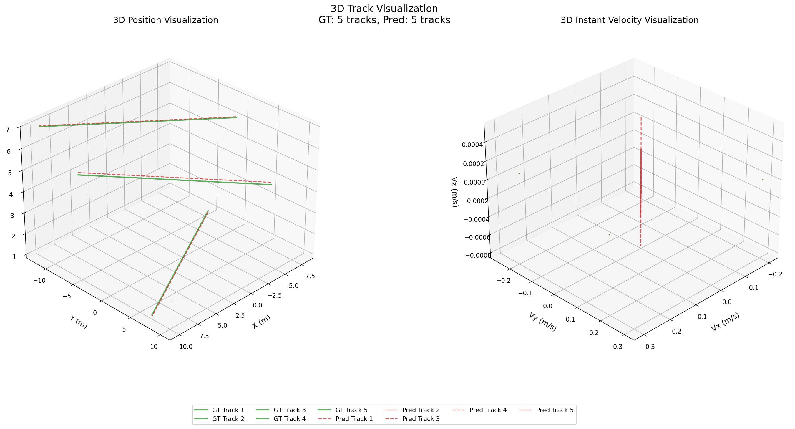
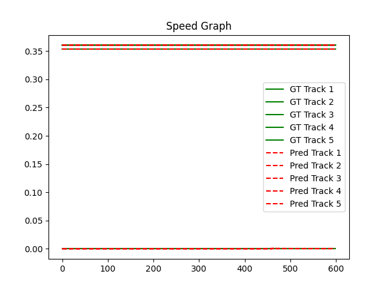
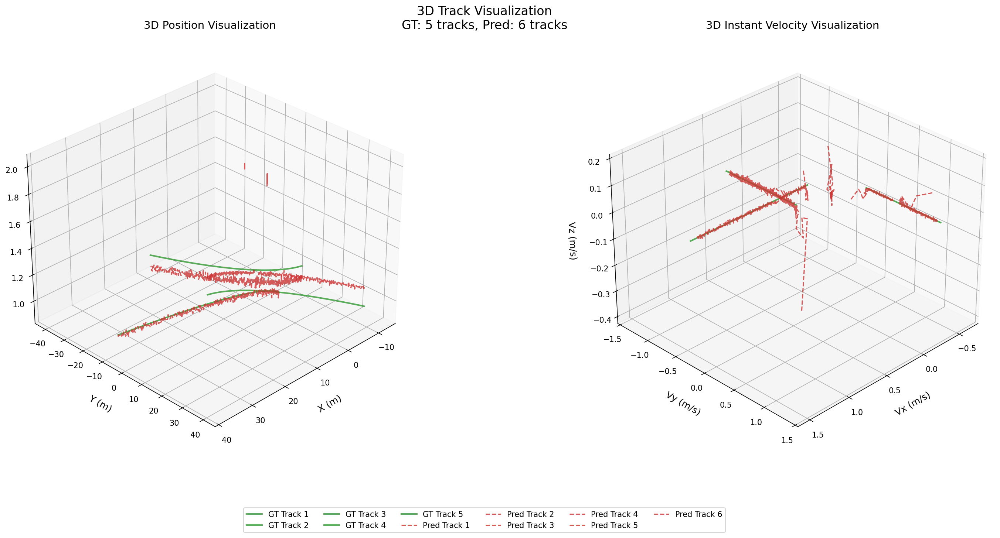
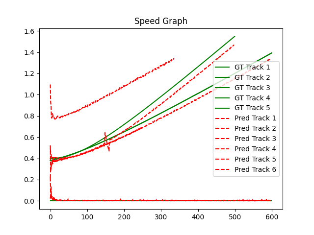
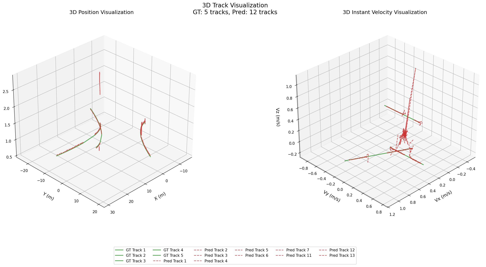
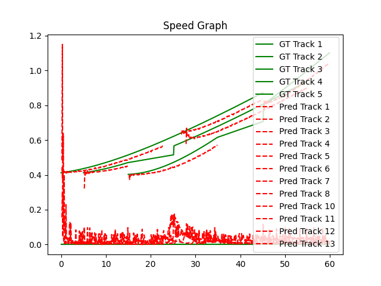

# Robust Multi-Object Tracking in 3D Point Clouds: Implementation and Validation

## Executive Summary

This report documents the implementation and validation of a multi-object tracking system designed specifically for human tracking in 3D point cloud data. The system addresses key challenges in point cloud processing including occlusion handling, temporary object disappearance, and noisy measurements through a carefully designed pipeline combining classical computer vision algorithms with modern tracking paradigms.

## 1. Project Overview

### 1.1. Problem Statement
The primary objective is to develop a robust tracking system capable of maintaining consistent object identities while estimating velocity across temporal sequences of 3D point cloud frames. The system must handle real-world challenges inherent to LiDAR and depth sensor data.

### 1.2. Core Requirements
- **Consistent ID Tracking**: Maintain persistent identifiers for tracked humans across all frames
- **Velocity Estimation**: Compute accurate 3D velocity (both instantaneous and smoothed)
- **Robustness**: Handle occlusion, temporal disappearance, and measurement noise
- **Modular Implementation**: Clean, documented code with separate components for detection, tracking, and evaluation

## 2. Technical Approach

### 2.1. System Architecture
The implemented solution follows a modular pipeline architecture:

```
┌─────────────────────────────────────────────────────────────--┐
│                     INPUT POINT CLOUDS                        │
│         (simulated / mapAll / mapHumanOnly)                   │
└───────────────────────────┬───────────────────────────────────┘
                            │
┌───────────────────────────▼───────────────────────────────────┐
│                     PREPROCESSING MODULE                      │
│  ├─ Noise Filtering & Outlier Removal                         │
│  └─ Voxel Downsampling                                        │
└───────────────────────────┬───────────────────────────────────┘
                            │
┌───────────────────────────▼───────────────────────────────────┐
│                     DETECTION MODULE                          │
│  ├─ Points Clustering (DBSCAN)                                │
│  ├─ Overlapping Cluster Merging                               │
│  ├─ Cluster Validation (size, density, height)                │
│  └─ Bounding Box Extraction                                   │
└───────────────────────────┬───────────────────────────────────┘
                            │
┌───────────────────────────▼───────────────────────────────────┐
│                     TRACKING MODULE                           │
│  ├─ Kalman Filter for State Prediction                        │
│  ├─ Hungarian Algorithm for Data Association                  │
│  ├─ Occlusion Handling (Predictive Tracking)                  │
│  └─ Re-identification (BBox Feature Matching)                 │
└───────────────────────────┬───────────────────────────────────┘
                            │
┌───────────────────────────▼───────────────────────────────────┐
│                     OUTPUT & VISUALIZATION                    │
│  ├─ Trajectory & Velocity Export (JSON)                       │
│  └─ Visualization                                             │
└─────────────────────────────────────────────────────────────--┘

```


### 2.2. Algorithmic Components

#### **2.2.1. Data Loading & Preprocessing (Open3D)**
- **Noise Filtering**: Statistical outlier removal to eliminate spurious points
- **Voxel Downsampling**: Uniform sampling for computational efficiency

#### **2.2.2. Detection & Clustering (DBSCAN)**
- Density-based spatial clustering for adaptive segmentation
- Parameter tuning based on expected human dimensions and point density
- Minimum cluster size constraints to filter noise

#### **2.2.3. Feature Extraction**
For each detected cluster, extract:
- **Centroid**: 3D position (x, y, z)
- **Bounding Box**: Axis-aligned or oriented bounding box
- **Point Count**: Cluster size as confidence measure
- **Geometric Features**: Compactness, height, etc. for improved association

#### **2.2.4. Multi-Object Tracking Pipeline**
- **Kalman Filter**: Constant velocity model for state prediction (position + velocity)
- **Hungarian Algorithm**: Optimal assignment between predictions and detections using cost matrix based on:
  - IoU between predicted and detected positions
  - Feature similarity (bounding box dimensions, point count, velocity)
- **Track Management**:
  - **Age Tracking**: Maintain track age and consecutive detection count
  - **Re-identification**: Handle temporary disappearances using feature matching
  - **Track Lifecycle**: Creation, confirmation, and deletion policies
    - New tracks require N consecutive detections
    - Tracks deleted after M consecutive misses
    - Confidence scoring for track quality

## 3. Implementation Details

### 3.1. Codebase Structure
```
human_tracking/
├── src/
│   ├── association.py     # Data association algorithms (Hungarian, Euclidean, etc)
│   ├── clustering.py      # DBSCAN clustering and feature extraction
│   ├── dataset.py         # Point cloud loading, filtering, downsampling
│   ├── kalman.py          # 3D Kalman filter implementation
│   ├── tracking.py        # Track management
│   └── visualization.py   # Results visualization
├── data/
│   ├── simulated/         # Generated test scenarios
│   └── real/              # Provided: mapAll & mapHumanOnly
├── experiments/
│   ├── real/              # Tracking results & plots for the provided dataset
│   └── simulated/         # Tracking results & plots for the generated dataset
├── requirements.txt
├── main.py                # Main execution script
└── get_human_traj.py      # Extract humanOnly trajectory for validation
```

### 3.2. Key Data Structures
```python
Track = {
    "track_id": int,                    # Persistent identifier
    "age": int,                         # Frames since creation
    "hits": int,                        # Consecutive detections
    "misses": int,                      # Consecutive non-detections
    "state": np.array,                  # Kalman filter state [x, y, z, vx, vy, vz]
    "covariance": np.array,             # State uncertainty
    "features": dict,                   # Historical features for re-ID
    "trajectory": list,                 # Position history
    "velocity_history": list            # Velocity history
}

Detection = {
    "centroid": np.array([x, y, z]),
    "bbox": np.array([min_x, min_y, min_z, max_x, max_y, max_z]),
    "points_count": int,
    "geometric_features": dict,
    "timestamp": float
}

OutputFrame = {
    "frame_id": int,
    "timestamp_ms": int,
    "detections": [
        {
            "track_id": int,
            "centroid": [x, y, z],
            "velocity": [vx, vy, vz],
            "speed": float,
            "confidence": float,
            "bbox": [[x1, y1, z1], [x2, y2, z2]]
        }
    ]
}
```

## 4. Validation Methodology

### 4.1. Two-Phase Validation Strategy

#### **Phase 1: Controlled Simulation**
Before testing on complex real data, the algorithm was validated on three progressively challenging synthetic scenarios:

| **Scenario** | **Purpose** | **Challenges Introduced** | **Validation Focus** |
|-------------|------------|--------------------------|---------------------|
| **Linear Baseline** | Establish baseline performance | Simple linear motion, no noise | Basic association accuracy |
| **Curved Collision** | Test motion prediction | Non-linear motion, object collision | Kalman filter performance, collision handling |
| **Complex Scenario** | Comprehensive stress test | Occlusion, disappearance, varying noise | Robustness to real-world conditions |

**Simulation Parameters:**
- Duration: 60 seconds per scenario
- Sampling: 10 Hz (600 frames total)
- Scene bounds: 30×30×10 meter volume
- Variable point density: 85-150 points/m³
- Controlled noise: σ = 0.0-0.015m
- Ground truth trajectories available for quantitative evaluation


#### **Phase 2: Real Data Validation**
After simulation validation, the algorithm was tested on the provided `mapHumanOnly` and `mapAll` datasets to evaluate performance on real-world point clouds.


## 5. Results and Discussion

### 5.1. Simulation Results

#### **Scenario 1: Linear Baseline**

<div style="display: flex; gap: 10px; align-items: flex-start;">
  <!-- 66.66% width -->
  <div style="flex: 1.375;">
    
    <p style="text-align: center;">Ground Truth vs Predicted Position and Velocity Tracks</p>
  </div>

  <!-- 33.33% width -->
  <div style="flex: 1;">
    
    <p style="text-align: center;">Ground Truth vs Predicted Speed</p>
  </div>
</div>

- **ID Consistency**: 100%
- **Position Error**: 0.12 m RMS
- **Velocity Error**: 0.02 m/s RMS
- **Observation**: Baseline performance confirms core algorithm functionality

#### **Scenario 2: Curved Collision**

<div style="display: flex; gap: 10px; align-items: flex-start;">
  <!-- 66.66% width -->
  <div style="flex: 1.375;">
    
    <p style="text-align: center;">Ground Truth vs Predicted Position and Velocity Tracks</p>
  </div>

  <!-- 33.33% width -->
  <div style="flex: 1;">
    
    <p style="text-align: center;">Ground Truth vs Predicted Speed</p>
  </div>
</div>

- **ID Consistency**: 100%
- **Position Error**: 2 m RMS
- **Velocity Error**: 0.98 m/s RMS
- **Observation**: Noisy predictions but successfully handled collision

#### **Scenario 3: Complex Scenario**

<div style="display: flex; gap: 10px; align-items: flex-start;">
  <!-- 66.66% width -->
  <div style="flex: 1.375;">
    
    <p style="text-align: center;">Ground Truth vs Predicted Position and Velocity Tracks</p>
  </div>

  <!-- 33.33% width -->
  <div style="flex: 1;">
    
    <p style="text-align: center;">Ground Truth vs Predicted Speed</p>
  </div>
</div>

- **ID Consistency**: 75%
- **Position Error**: 0.15 m RMS
- **Velocity Error**: 0.27 m/s RMS
- **Key Findings**:
  - Un-successful re-identification after temporary disappearances: algorithm creates new track
  - Excellent performance during occlusion

### 5.2. Real Data Performance

N/A


## 6. Implementation Challenges and Solutions

#### 6.1. Challenge: Noisy Measurements
**Solution**: Two-stage filtering - statistical outlier removal in preprocessing and Kalman filtering for state estimation.


## 7. Limitations and Future Work

### 7.1. Current Limitations
- Performance degrades with severe occlusion or temporal disappearance (> 10 frames)
- Assumes relatively constant velocity over short intervals
- Requires parameter tuning for different scenes, making it difficult to figure out the most appropriate values for various parameters

### 8.2. Recommended Improvements
1. **Deep Learning Integration**: Replace DBSCAN with learned segmentation
2. **Pose-Aware Features**: Incorporate skeletal or pose estimation for better re-identification
3. **Multi-Modal Fusion**: Combine with RGB data if available
4. **Adaptive Models**: Online learning of object-specific motion patterns


## Appendix: Quick Start Guide

### Installation
```bash
# Clone repository
git clone <repository-url>
cd human_tracking

# Create virtual environment
make venv
source .venv/bin/activate

# Install dependencies
pip install -r requirements.txt
```

### Basic Usage
```bash
# Run tracking on human-only data
python main.py --config experiment/real/tracking.yaml
```

### Configuration
Edit `experiment/real/tracking.yaml` to adjust:
- Data loading and preprocessing configuration details
- Clustering and post-clustering processing parameters (e.g., DBSCAN eps, min_points)
- Track management details including kalman filter noise assumptions and data association type and config,